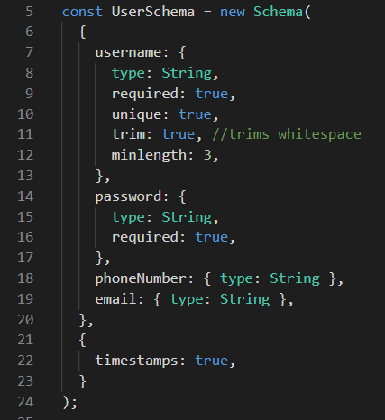
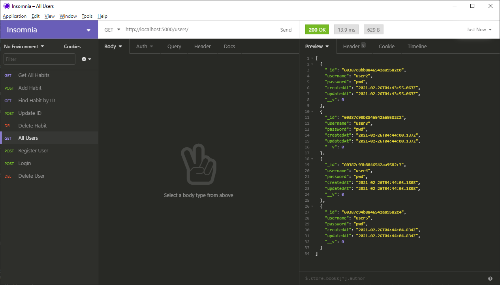
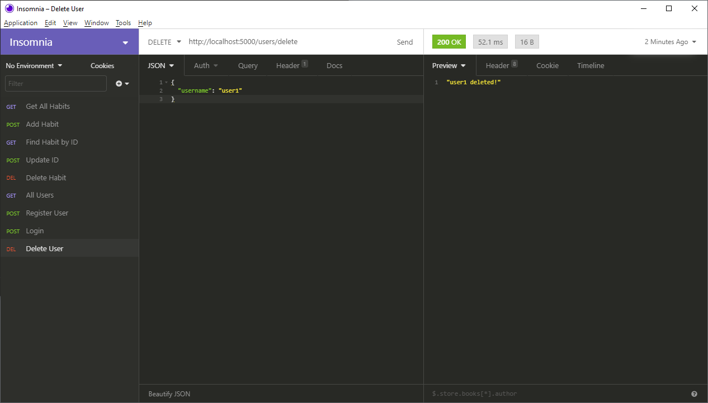
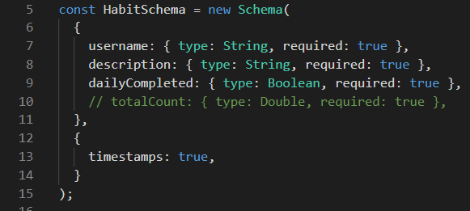
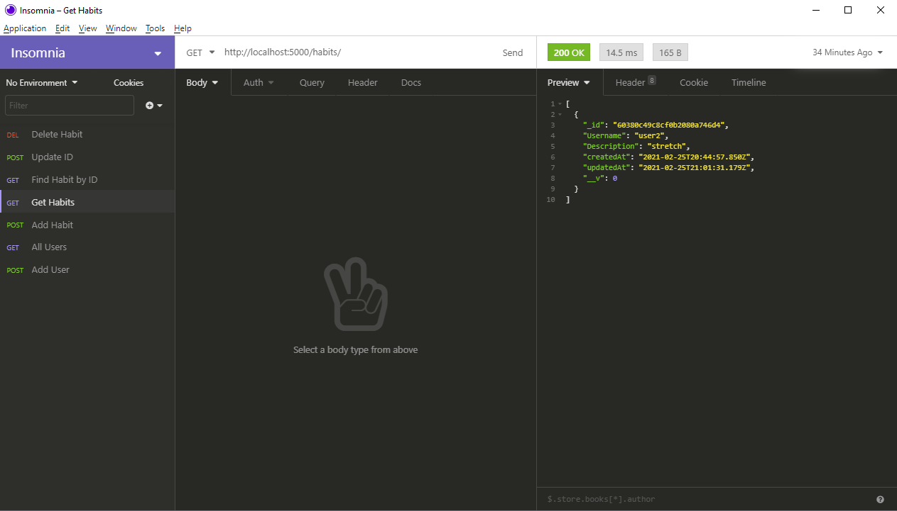
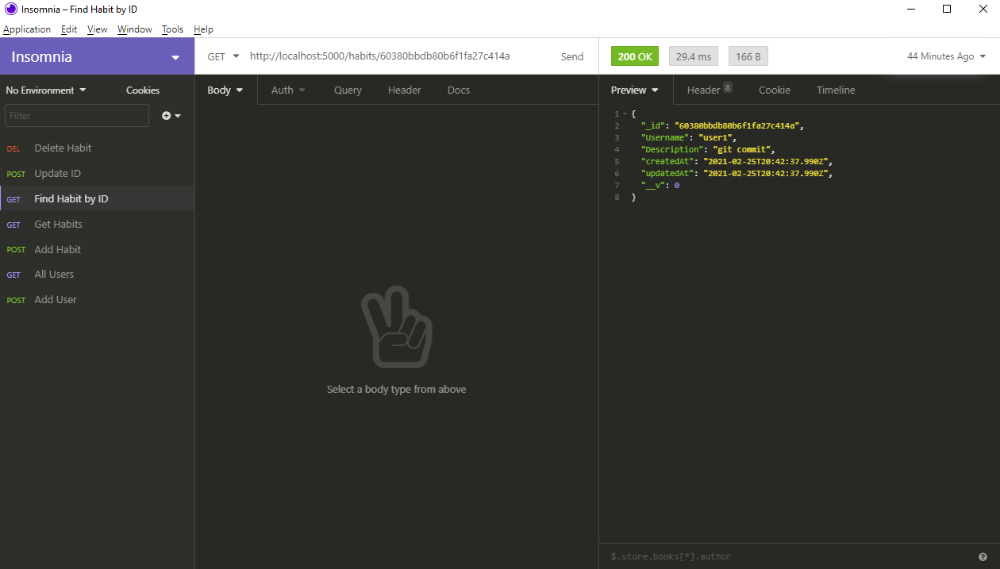
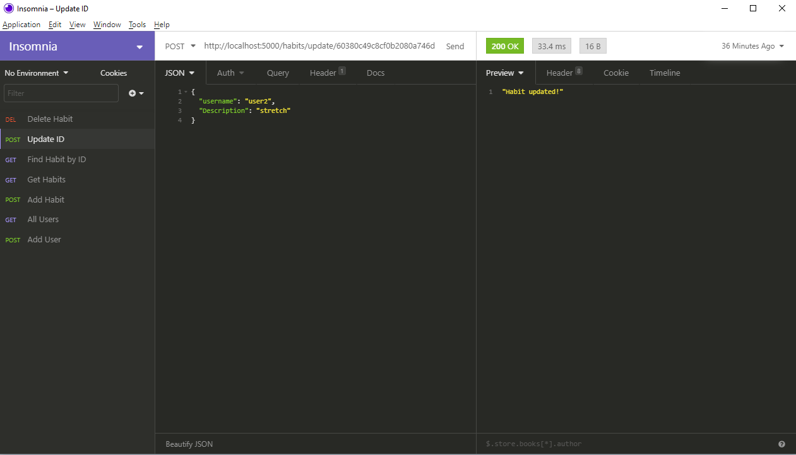
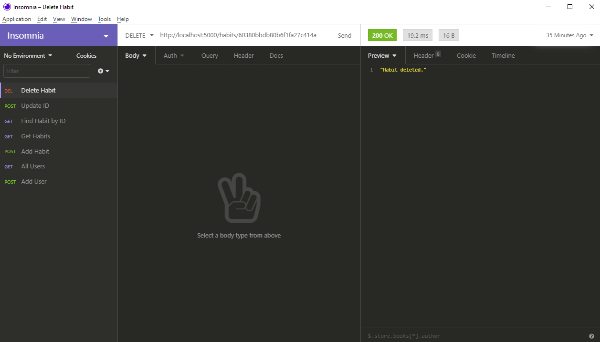

make sure you're in the backend directory

create .env file in backend directory with `ATLAS_URI=` remember to change put your password in

`yarn install`

`yarn start` OR `yarn run start`

###

Use Insomnia or Postman to test backend API

### User Routes

Read All Users - GET http://localhost:5000/users/

Register User - POST http://localhost:5000/users/register

- remember to use JSON body

Login User - POST http://localhost:5000/users/Login

- remember to use JSON body

Delete User - DELETE http://localhost:5000/users/register

- remember to use JSON body

### Habit Routes

Read All Habits - GET http://localhost:5000/habits/

Add Habit - GET http://localhost:5000/habits/add

Read Single Habit - GET http://localhost:5000/habits/{id}

Update Single Habit - POST http://localhost:5000/habits/update/{id}

- remember to use JSON body

Delete Single Habit - DELETE http://localhost:5000/habits/{id} (Find one using read all habits first)

